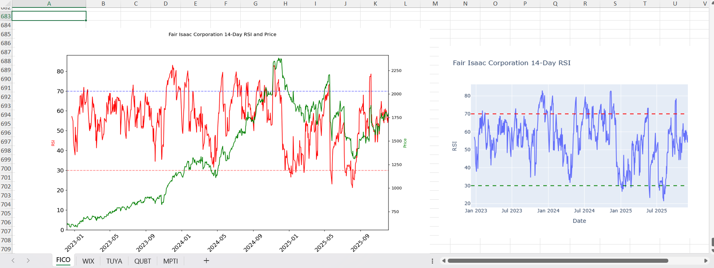
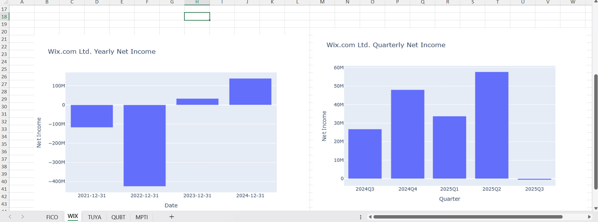

# 🚀 Undervalued Stock Screener 📈

A python based stock screener designed to identify potentially undervalued companies
with strong financial fundamentals. It combines fundamental analysis, sector benchmarking,
and technical indicators to provide a deeper view of a stock's financial health. Both yearly and quarterly
data is used to ensure there are no recent issues that yearly data may not capture.

---

### Screening Ideology
The screener begins by filtering for companies whose price-to-book ratio is below their
respective sector average. Since low valuations also indicate weak fundamentals, the screener adds
the following requirements to avoid "value traps":
- Consistent revenue growth
- Low or improving debt levels
- Healthy profit margins
- Altman Z-Score for financial stability

---
## 📒 Features
- **Fundamental Screening**
  - Focuses on major U.S. exchanges including NYSE, NASDAQ (all tiers), and NYSE American.
  - Select a sector to analyze
  - Evaluates:
    - Price-to-book ratio vs sector average
    - Debt-to-equity ratio at or below sector average
    - Revenue Growth
    - Profit Margins
    - Altman Z-Score of at least 2.8
 
- **Fundamental Metric Plots**
  - Net Income (Yearly and Quarterly)
  - Shareholder Equity (Yearly and Quarterly)
  - Operating Cash Flow and Free Cash Flow (Yearly and Quarterly)
  - Return on Invested Capital (ROIC)
  - Free Cash Flow Margin (Yearly and Quarterly)
  - Operating Income Growth (Yearly and Quarterly)
  - Operating Margin + Trend (Yearly and Quarterly)
  - Gross Margin (Yearly and Quarterly)

- **Plots the following technical indicators**
  - 3 Year Price chart
  - RSI (Relative Strength Index)
  - Price with RSI overlay
  - MACD (Moving Average Convergence/Divergence)
  - Price with MACD Indicators
  - Stochastic Oscillator
  - Price with Stochastic overlay

---

## 📂 File Structure
```
stock-screener
├── data/
│   ├── blank_templates/
│   │   ├── industry_blank.db
│   │   └── sector_blank.db
│   ├── industry_averages.db # Data for industry average comparisons
│   └── sector_averages.db # Data for sector average comparisons
├── notebooks/ # Initial data analysis notebooks
│   ├── eps.ipynb
│   ├── oversold-tech-stocks.ipynb
│   └── wix.ipynb
├── outputs/ # Example outputs
│   ├── ex_images/
│   │   ├── FICO_RSI.png
│   │   └── WIX_netIncome.png
│   ├── Communication Services_2026-02-04.xlsx  
│   ├── Healthcare_2026-02-04.xlsx
│   └── Technology_2026-02-04.xlsx
├── scraping/
│   └── yfinance_scraper.py # Use to obtain industry and sector labels
├── scripts # Contains main script for analysis
│   └── main.py
├── src # Source scripts for screening and analysis
│   ├── industry_metrics/ # Use to update industry averages
│   │   ├── ind_avg_calc.py
│   │   └── ind_generator.py
│   ├── screening/ # scripts for main.py
│   │   ├── earnings.py
│   │   ├── financial_metrics.py
│   │   ├── get_financials.py
│   │   ├── initial_screen.py
│   │   └── technical_indicators.py
│   └── sector_metrics/ # Use to update sector metrics
│       ├── sector_avg_calc.py
│       └── sector_generator.py
├── README.md # Current file
└── requirements.txt # Required packages
```

---

## 🚧 Setup Instructions

1. **Clone the repository**

```git clone https://github.com/JustinWoo20/stock-screener.git```

2. **Navigate to project repository**

```cd stock-screener```

3. **Create and activate new environment**
Create:

```python -m venv .venv```

Activate it:

Windows ```.\.venv\Scripts\activate```

macOS/Linux ```source .venv/bin/activate```

4. Install dependencies
```pip install -r requirements.txt```

5. Run the screener
```python scripts/main.py```

6. Select target sector when prompted

---

## 📷 Example Outputs




---
## 📌 Future Improvements
- Web UI using Flask
- Additional screening parameters
- Parameter controls in the UI
- Additional output options (Currently only supports graph outputs)
  - Graph
  - Only data
  - Data and graphs
- Option for single stock analysis

---

### 📜 License
MIT License – free to use, modify, and distribute.

---

### 🎯 Update
- Refactored from csv to SQLite

---
### ⚠️ Disclaimer
This tool is not licensed financial advice. It is intended for discovering possible investment ideas. 
It should not be used as the deciding factor for investment decisions. 
Always perform independent research and consult a licensed financial professional before any stock purchases.